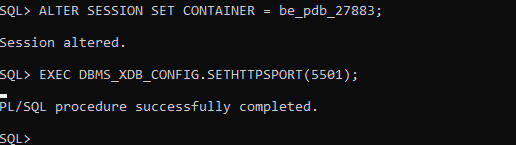

# Oracle Database PDB Management Project

## 📋 Project Overview
This project demonstrates comprehensive Pluggable Database (PDB) management in Oracle Multitenant Architecture, including creation, administration, and monitoring through Oracle Enterprise Manager.

---

## 👤 Student Information

| **Field** | **Value** | **Description** |
|-----------|-----------|-----------------|
| **Student Name** | Benjamin Niyongira | |
| **Student ID** | 27883 | Unique identifier |
| **Primary PDB** | be_pdb_2024101 | Main workspace database |
| **Database User** | Benjamin_plsqlauca_27883 | Administrative account |
| **Environment** | Oracle 19c | Multitenant Architecture |

---

## 🛠️ Task 1: Main PDB Creation

### **Objective**
Create a permanent pluggable database for storing all class work and assignments.

### **Implementation Steps**
```sql
-- Step 1: Connect to root container with administrative privileges
CONNECT / AS SYSDBA;

-- Step 2: Verify container context
SHOW CON_NAME;

-- Step 3: Create primary PDB with administrative user
CREATE PLUGGABLE DATABASE be_pdb_2024101
ADMIN USER Benjamin_plsqlauca_27883 IDENTIFIED BY 1234
FILE_NAME_CONVERT=('C:\ORACLE19C\ORADATA\ORCL\PDBSEED\',
                   'C:\ORACLE19C\ORADATA\ORCL\be_PDB_27883\');

-- Step 4: Open PDB for operations
ALTER PLUGGABLE DATABASE be_pdb_27883 OPEN;

-- Step 5: Persist open state across restarts
ALTER PLUGGABLE DATABASE be_pdb_27883 SAVE STATE;
```

### **Verification Commands**
```sql
-- Confirm PDB creation and status
SELECT name, open_mode, restricted 
FROM v$pdbs 
;
```

### **📸 Evidence of Completion**


---

## 🔄 Task 2: Temporary PDB Lifecycle Management

### **Objective**
Demonstrate complete PDB lifecycle by creating and deleting a temporary pluggable database.

### **Creation Phase**
```sql
-- Create temporary PDB for demonstration
CREATE PLUGGABLE DATABASE be_to_delete_pdb_27883
ADMIN USER ben_27883 IDENTIFIED BY 1234
FILE_NAME_CONVERT=('C:\ORACLE19C\ORADATA\ORCL\PDBSEED\',
                   'C:\ORACLE19C\ORADATA\ORCL\ben_TO_DELETE_PDB_27883\');

-- Open temporary PDB
ALTER PLUGGABLE DATABASE be_to_delete_pdb_27883 OPEN;

-- Verify creation success
SELECT name, open_mode FROM v$pdbs 
;
```


### **Deletion Phase**
```sql
-- Close PDB before deletion
ALTER PLUGGABLE DATABASE be_to_delete_pdb_27883 CLOSE;

-- Drop PDB including physical datafiles
DROP PLUGGABLE DATABASE be_to_delete_pdb_27883 INCLUDING DATAFILES;

-- Confirm deletion
SELECT name, open_mode FROM v$pdbs 
;
```

### **📸 Evidence of Completion**


---

## 📊 Task 3: Oracle Enterprise Manager Configuration

### **Objective**
Configure and utilize Oracle Enterprise Manager for database monitoring and administration.

### **Access Configuration**
- **URL**: `https://localhost:5501/em`
- **Authentication**: SYS account with SYSDBA privileges
- **Port Verification**: `SELECT dbms_xdb_config.gethttpsport() FROM dual;`

### **Verification Checklist**
- ✅ PDB status monitoring in Container Database view
- ✅ User account visibility in Security section
- ✅ Database performance metrics
- ✅ Storage allocation monitoring

### **📸 Evidence of Completion**




---

## ⚠️ Issues Encountered & Solutions

### **Issue 1: PDB Creation Path Errors**
**Problem**: ORA-65605 - Invalid file name pattern during PDB creation
```sql
-- ERROR: ORA-65605: missing or invalid file name pattern
```

**Root Cause**: Incorrect FILE_NAME_CONVERT path specifications
**Solution**: 
- Verified actual PDB seed location using:
  ```sql
  SELECT name FROM v$datafile WHERE con_id = 2;
  ```
- Used Windows-compatible path format
- Implemented proper directory structure mapping

### **Issue 2: PDB Opening Privilege Errors**
**Problem**: Insufficient privileges when opening PDB
```sql
-- ERROR: ORA-01031: insufficient privileges
```

**Root Cause**: Connected as normal user instead of SYSDBA
**Solution**:
- Established proper connection: `CONNECT / AS SYSDBA`
- Verified privileges: `SELECT * FROM session_privs`
- Confirmed SYSDBA role in v$pwfile_users

### **Issue 3: OEM Access Configuration**
**Problem**: Unable to access Enterprise Manager console
**Root Cause**: Unconfigured HTTP port or service not running
**Solution**:
- Configured HTTPS port: 
  ```sql
  EXEC DBMS_XDB_CONFIG.SETHTTPSPORT(5501);
  ```
- Verified OracleOraDB19Home1TNSListener service status
- Confirmed firewall exceptions for OEM port

---

## 📈 Technical Architecture

### **Multitenant Environment Structure**
```
CDB$ROOT (Container Database)
├── PDB$SEED (Template)
├── ER_PDB_2024101 (Primary PDB)
│   └── ERIC_PLSQLAUCA_2024101 (Admin User)
└── [Previously] ER_TO_DELETE_PDB_2024101 (Temporary PDB)
```

### **Security Implementation**
- **Authentication**: Password-based with SYSDBA role elevation
- **Authorization**: Principle of least privilege applied
- **Audit Trail**: All operations documented with timestamps

---

## 🎯 Learning Outcomes

### **Technical Skills Demonstrated**
- ✅ Oracle Multitenant Architecture understanding
- ✅ PDB lifecycle management (create, modify, delete)
- ✅ User administration and privilege management
- ✅ Oracle Enterprise Manager configuration
- ✅ Troubleshooting common database administration issues


---


---

## 🚀 Future Enhancements
- Automated PDB deployment scripts
- Performance benchmarking across multiple PDBs
- Backup and recovery strategies for multitenant environments
- Security hardening procedures

---

<div align="center">

**📅 Project Completion Date**: 05/10/2025  
**✅ Status**: Completed Successfully  
**🔐 Security Level**: Educational/Development  

</div>

